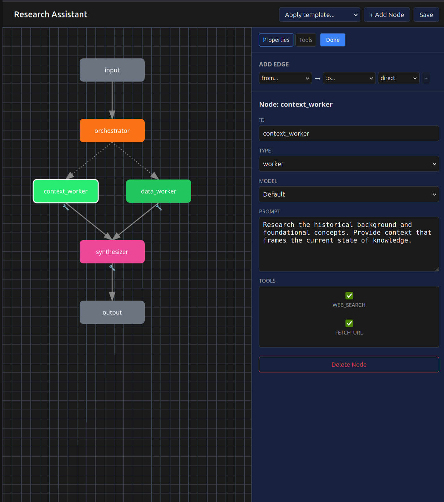

# fissio

A visual agent orchestration platform written in Rust + Solid.js. Design, configure, and run multi-agent pipelines using agentic patterns.

## Features

- **Visual Pipeline Editor** — Drag-and-drop node configuration with real-time preview
- **Template Patterns** — 5 built-in templates based on proven agentic architectures
- **Custom Configs** — Save, load, and manage your own pipeline configurations
- **Tool Support** — Assign tools (web search, URL fetch) to nodes for agentic capabilities
- **Real-time Streaming** — Token-by-token response streaming via WebSocket
- **Multi-model Support** — OpenAI cloud models + auto-discovered Ollama local models
- **Dev Mode** — Toggle verbose metrics (tokens/sec, eval time, load time)



## Pipeline Patterns

The app includes templates for common agentic patterns:

| Pattern | Use Case | Example |
|---------|----------|---------|
| **Prompt Chaining** | Sequential refinement with quality gates | Blog Post Writer |
| **Routing** | Classify and dispatch to specialized handlers | Customer Support Bot |
| **Parallelization** | Run independent tasks concurrently | Document Reviewer |
| **Orchestrator-Worker** | Dynamic task decomposition | Research Assistant |
| **Evaluator-Optimizer** | Self-critique loop for quality assurance | Code Generator |

## Architecture

```
┌─────────────────┐                    ┌─────────────────────────────────────┐
│  Solid.js UI    │◄──── WebSocket ────│              Agent                  │
│                 │                    │                                     │
│  Header         │                    │  Model Discovery                    │
│  ├─ Config      │                    │  ├── OpenAI (cloud)                 │
│  └─ Model       │                    │  └── Ollama /api/tags (local)       │
│                 │                    │                                     │
│  Pipeline       │                    │  Pipeline Execution                 │
│  Editor         │                    │  ├── Templates (read-only)          │
│                 │                    │  └── User Configs (SQLite)          │
│  Chat           │                    │                                     │
│  └─ Streaming   │                    │  Node Types                         │
└─────────────────┘                    │  ├── llm, router, gate              │
                                       │  ├── coordinator, aggregator        │
                                       │  ├── orchestrator, worker           │
                                       │  └── evaluator, synthesizer         │
                                       └─────────────────────────────────────┘
```

## Technologies

- **Client:** Solid.js, TypeScript
- **Agent:** Rust, Axum, Tokio, SQLite (rusqlite)
- **LLM:** OpenAI API, Ollama (local models)

## Prerequisites

- Docker & Docker Compose
- (Optional) [Ollama](https://ollama.ai) for local models

## Environment

Create a `.env` file in `agent/`:

```env
OPENAI_API_KEY=sk-...
ANTHROPIC_API_KEY=sk-...    # Optional: for Anthropic models
TAVILY_API_KEY=tvly-...     # Optional: enables web_search tool
RUST_LOG=info
```

## Run

```bash
docker compose up
```

- Client: http://localhost:3001
- Composer: http://localhost:3001/composer
- Agent API: http://localhost:8000

## Usage

1. **Select a config** from the dropdown (5 examples included)
2. **Click the edit button** (✎) to open the pipeline editor
3. **Modify nodes** — change prompts, models, or node types
4. **Save** your changes as a new config or update existing
5. **Send a message** to run the pipeline

## Compose Mode

The `/composer` route provides a visual pipeline editor for designing agent workflows.

### Workflow

1. **Load a template** — Select from the "Apply template..." dropdown to start with a proven pattern
2. **Edit nodes** — Click any node to configure:
   - **ID** — Unique identifier
   - **Type** — Node behavior (llm, router, orchestrator, worker, etc.)
   - **Model** — Override the default model for this node
   - **Prompt** — System instructions for LLM nodes
   - **Tools** — Enable `web_search` or `fetch_url` for agentic capabilities
3. **Add edges** — Use the "Add Edge" controls to connect nodes with edge types:
   - `direct` — Standard sequential flow
   - `conditional` — Router-based branching
   - `parallel` — Concurrent execution
   - `dynamic` — Orchestrator-dispatched workers
4. **Save** — Persist your configuration to the database

### Tools

Nodes can be assigned tools that enable autonomous information gathering:

| Tool | Description | Requires |
|------|-------------|----------|
| `fetch_url` | Fetches and parses web page content | — |
| `web_search` | Searches the web via Tavily API | `TAVILY_API_KEY` |

Tools are executed in an agentic loop: the LLM requests a tool → backend executes → results fed back → LLM continues until it produces a final response.

## Local Models (Ollama)

The agent auto-discovers installed Ollama models at startup.

```bash
ollama pull llama3.1
ollama serve
```

Models appear in the dropdown automatically.
